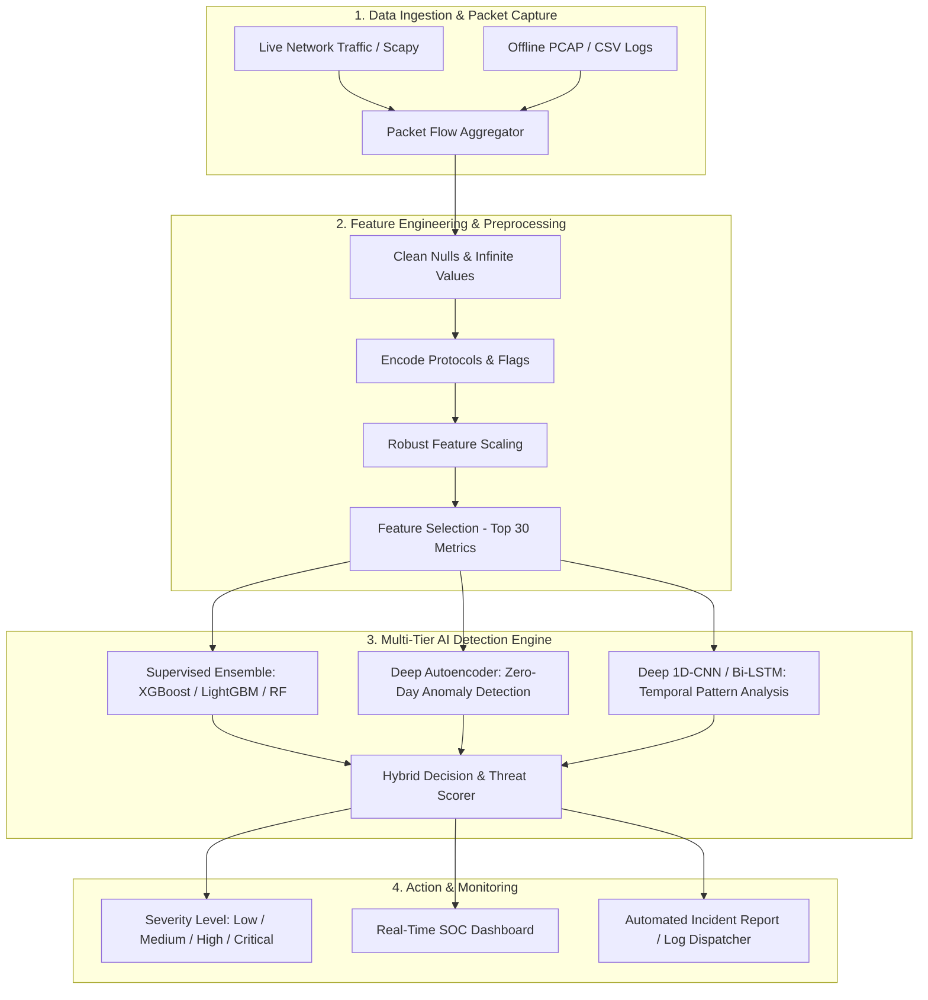

# AI-Based Network Intrusion Detection System (NIDS) 🛡️⚡

[](https://www.python.org/)
[](https://scikit-learn.org/)
[](https://streamlit.io/)
[](LICENSE)
[]()

An intelligent, high-throughput **AI-powered Network Intrusion Detection System (NIDS)** designed to inspect network traffic, extract flow telemetry, detect anomalous patterns, and classify malicious cyber threats in real time with sub-millisecond inference latency.

---

## 📑 Table of Contents
- [Overview & Motivation](#-overview--motivation)
- [Key Features](#-key-features)
- [Threat Taxonomy & Detection Capabilities](#-threat-taxonomy--detection-capabilities)
- [System Architecture](#-system-architecture)
- [Machine Learning & Deep Learning Pipeline](#-machine-learning--deep-learning-pipeline)
- [Project Structure](#-project-structure)
- [Installation & Setup](#-installation--setup)
- [Usage Guide](#-usage-guide)
- [Evaluation & Benchmarks](#-evaluation--benchmarks)
- [Roadmap](#-roadmap)
- [License](#-license)

---

## 🔍 Overview & Motivation

Traditional **Signature-Based Intrusion Detection Systems (SIDS)** rely on static databases of known attack patterns (e.g., Snort rules). While effective against established threats, they suffer from two critical flaws:
1. **Inability to detect Zero-Day Attacks** and polymorphic malware variants.
2. **High maintenance overhead** required to write and update manual rule sets.

This project implements an **AI/ML-Driven Anomaly & Misuse Detection Engine** that learns the underlying statistical and temporal distributions of legitimate network flows. By combining **Supervised Ensemble Classifiers** (for high-confidence known threat classification) with **Unsupervised Deep Autoencoders** (for zero-day anomaly isolation), the system achieves state-of-the-art detection rates while minimizing alert fatigue caused by false positives.

---

## 🌟 Key Features

* **Real-Time & Batch Flow Inspection:** Ingests raw PCAP packet streams via `Scapy` / `PyShark` or batch flow logs (`CSV`).
* **Multi-Class Threat Classification:** Categorizes malicious activity across 10+ distinct attack vectors.
* **Zero-Day Anomaly Detection:** Deep Autoencoders compute reconstruction errors to flag never-before-seen anomalous behaviors.
* **Low False-Positive Rate (FPR):** Tuned decision thresholds and robust feature scaling prevent alert fatigue in security operation centers (SOC).
* **Interactive SOC Dashboard:** Streamlit-powered visual dashboard featuring real-time packet monitors, threat distribution analytics, severity gauges, and incident logs.
* **Modular Pipeline Architecture:** Clean separation of data ingestion, preprocessing, training, inference, and UI modules.

---

## 🎯 Threat Taxonomy & Detection Capabilities

| Threat Category | Specific Attacks Detected | Detection Mechanism |
| :--- | :--- | :--- |
| **Denial of Service (DoS / DDoS)** | SYN Flood, UDP Flood, Slowloris, LOIC, GoldenEye | Flow rate, inter-arrival time spikes, packet size variance |
| **Reconnaissance & Probing** | Port Scanning (Nmap), Ping Sweeps, OS Fingerprinting | High distinct destination port counts, rapid connection attempts |
| **Brute Force Attacks** | SSH Brute Force, FTP Brute Force | Repetitive authentication attempts, failed handshake patterns |
| **Web Application Attacks** | SQL Injection, Cross-Site Scripting (XSS), Command Injection | Payload length anomaly, HTTP method & response status distributions |
| **Botnets & C2 Channels** | Ares, Mirai, IRC/HTTP Command & Control communication | Periodic beaconing patterns, abnormal flow duration and entropy |
| **Infiltration & Privilege Escalation** | Lateral movement, internal unauthorized port access | Abnormal source/destination host communication graphs |

---

## 🏗️ System Architecture



---

## 🧠 Machine Learning & Deep Learning Pipeline

1. **Feature Extraction:** Computes 80+ bidirectional flow statistical metrics (Forward/Backward packet length, inter-arrival time, byte ratios, TCP flag counts, window sizes).
2. **Preprocessing & Normalization:** `RobustScaler` is utilized to handle long-tailed network traffic distributions without distortion from extreme burst traffic.
3. **Class Imbalance Handling:** Implements SMOTE (Synthetic Minority Over-sampling Technique) and cost-sensitive class weights to address rare attack classes.
4. **Model Architecture:**
   - **XGBoost / LightGBM:** Primary multi-class classification engine for fast tabular inference (<2ms per batch).
   - **Deep PyTorch Autoencoder:** Trained exclusively on benign traffic; flags reconstruction loss exceeding threshold $\tau$ as zero-day anomalies.
   - **Model Serialization:** Pipeline artifacts (scalers, encoders, model weights) are exported using `joblib` for zero-overhead production loading.

---

## 📁 Project Structure

```text
AI_Based_Network_intrusion_detection/
├── .gitignore                  # Git ignore rules for datasets, models, env
├── README.md                   # Project documentation
├── requirements.txt            # Python dependencies
├── data/
│   ├── raw/                    # Raw benchmark datasets & PCAP files
│   └── processed/              # Cleaned, scaled feature matrices
├── models/
│   ├── scaler.joblib           # Fitted preprocessor scalers
│   ├── encoder.joblib          # Label/One-hot encoders
│   └── nids_best_model.joblib  # Trained model weights
├── notebooks/
│   ├── 01_exploratory_data_analysis.ipynb
│   ├── 02_feature_engineering.ipynb
│   └── 03_model_training_and_eval.ipynb
├── src/
│   ├── __init__.py
│   ├── data_loader.py          # Dataset ingestion & stream parser
│   ├── preprocessor.py         # Cleaning, encoding & scaling pipeline
│   ├── train.py                # Model training & hyperparameter search
│   ├── evaluate.py             # Metrics, confusion matrix, ROC-AUC
│   ├── predict.py              # Low-latency inference engine
│   └── live_sniffer.py         # Real-time packet sniffer & flow builder
├── app/
│   ├── app.py                  # Streamlit SOC interactive dashboard
│   └── ui_components.py        # Dashboard charts & alert widgets
└── tests/
    ├── test_preprocessor.py    # Unit tests for preprocessing pipeline
    └── test_model.py           # Unit tests for model inference
```

---

## ⚙️ Installation & Setup

### 1. Clone the Repository
```bash
git clone https://github.com/Inayat001-A/AI_Based_Network_intrusion_detection.git
cd AI_Based_Network_intrusion_detection
```

### 2. Create and Activate a Virtual Environment
```bash
# Windows (PowerShell)
python -m venv venv
.\venv\Scripts\Activate.ps1

# Linux / macOS
python3 -m venv venv
source venv/bin/activate
```

### 3. Install Dependencies
```bash
pip install --upgrade pip
pip install -r requirements.txt
```

---

## 🚀 Usage Guide

### 1. Data Ingestion & Preprocessing
```bash
python src/preprocessor.py --input data/raw/dataset.csv --output data/processed/
```

### 2. Train the AI Models
```bash
python src/train.py --model xgboost --tune-hyperparameters
```

### 3. Run Model Evaluation & Generate Reports
```bash
python src/evaluate.py --model models/nids_best_model.joblib
```

### 4. Launch the Interactive SOC Dashboard
```bash
streamlit run app/app.py
```

---

## 📊 Evaluation & Benchmarks

The models are evaluated against key cybersecurity operational metrics:
* **Detection Rate (Recall):** $\frac{TP}{TP + FN}$ — Ensuring no malicious intrusions bypass undetected.
* **Precision:** $\frac{TP}{TP + FP}$ — Preventing false positive alarms.
* **False Positive Rate (FPR):** Target $< 0.5\%$ to prevent SOC alert fatigue.
* **Inference Latency:** Target $< 5\text{ms}$ per network flow batch.

---

## 🗺️ Roadmap

- [x] Repository initialization & environment configuration
- [x] Complete architecture specification & roadmap definition
- [ ] Exploratory Data Analysis (EDA) on benchmark intrusion dataset
- [ ] Automated feature engineering & preprocessing pipeline
- [ ] Supervised model training (XGBoost, LightGBM, Random Forest)
- [ ] Unsupervised Deep Autoencoder for Zero-Day threat detection
- [ ] Streamlit Real-Time Security Operations Center (SOC) dashboard
- [ ] Real-time packet capture integration with Scapy / PyShark
- [ ] Docker containerization for one-click deployment

---

## 📜 License
Distributed under the **MIT License**. See `LICENSE` for more information.
